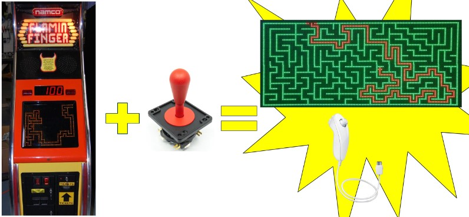

# References
#### [STM32L432KC Datasheet] ()
#### [STM32L432KC Reference Manual] ()
#### [iCE40 ] ()

# Inspiration
Our inspiration for this project started with the "Flamin' Finger" Arcade cabinet commonly seen at arcades. We originally wanted to try and recreate the game with our own spin on the game until we learned about Wii Nunchuks and how they use a communication protocol we have not learned so far: I2C. We thought that a combination of both ideas would maximize our learning and mastery of our hardware while also creating a fun minigame that can be enjoyed by others.

  

